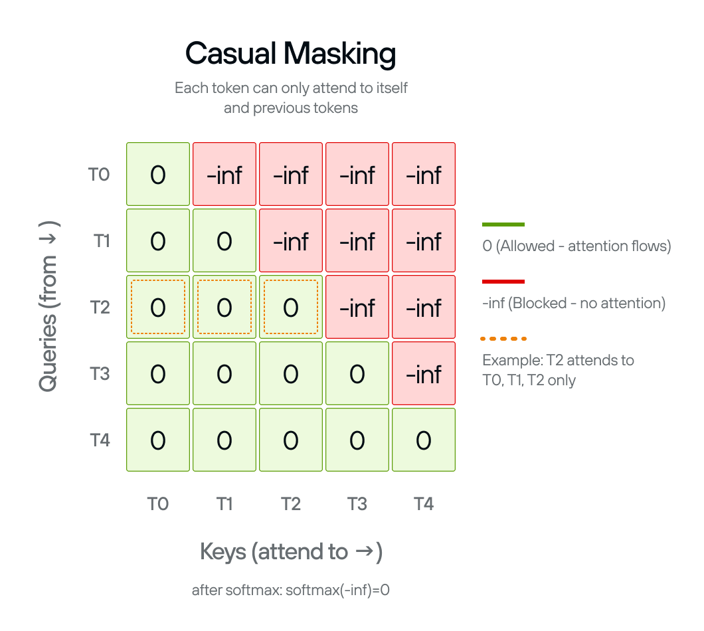
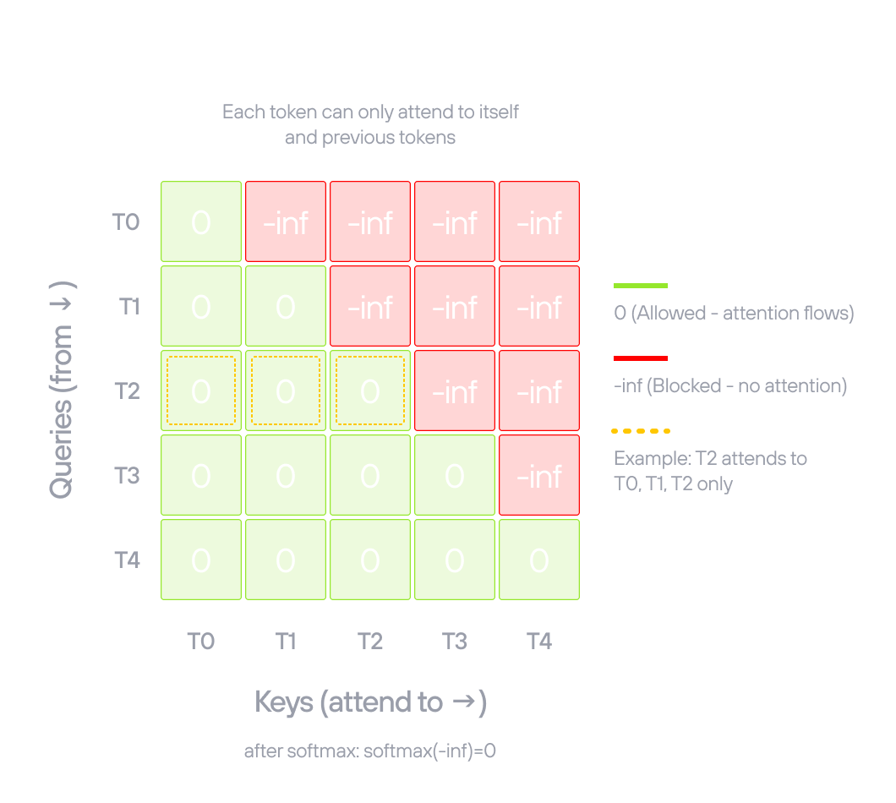

# Causal masking

<div class="note">

Create attention masks to prevent the model from _seeing_ future tokens during
[autoregressive](https://docs.modular.com/glossary/ai/autoregression)
generation.

</div>

Self-attention, without any constraint, lets every token attend to every other
token. That's fine for tasks where you have the full sequence at once—but GPT-2
generates text one token at a time, left-to-right. When predicting token _n_,
the model must not see tokens _n+1_ onward. Without a causal mask, the model
would learn to copy from future positions during training and produce nonsense
during generation.

The `causal_mask()` function creates a
[mask matrix](https://docs.modular.com/glossary/ai/attention-mask/) that sets
attention scores to `-inf` for future positions. After softmax, `-inf` becomes
zero probability, blocking information flow from later tokens.

<figure>


</figure>

## The mask pattern

The mask is lower-triangular: each token can attend to itself and all earlier
tokens, but nothing to its right.

- Position 0 attends to: position 0 only
- Position 1 attends to: positions 0–1
- Position 2 attends to: positions 0–2
- And so on...

The mask shape is `(sequence_length, sequence_length + num_tokens)`. The extra
`num_tokens` dimension is for
[KV cache](https://docs.modular.com/glossary/ai/kv-cache/) compatibility: during
generation, cached keys and values from earlier tokens can be attended to
without recomputing them.

## The code

The function uses the `@F.functional` decorator, which converts it to a MAX
graph operation that can be compiled and optimized.

The implementation creates a scalar `-inf` tensor, broadcasts it to the full
mask shape, then uses `F.band_part` to zero out the upper triangle
(`num_upper=0, exclude=True` keeps zeros on and below the diagonal, `-inf`
above):

```python
{{#include ../../gpt2.py:causal_mask}}
```

`Dim(sequence_length) + num_tokens` computes the total width of the mask using
symbolic dimension arithmetic, which lets the compiled graph handle variable
sequence lengths without recompilation.

**Next**: [Section 4](./step_04.md) uses this mask inside multi-head attention.
